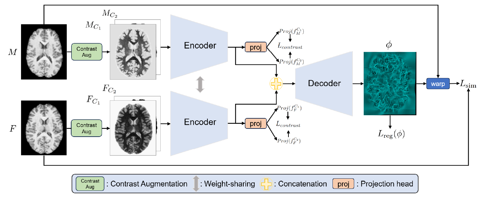

<h1 align="center">
  
    CAR: Contrast-Agnostic Deformable Medical Image Registration with Contrast-Invariant Latent Regularization (WBIR 2024)  
    <a href="https://arxiv.org/abs/2408.05341" target="_blank" style="text-decoration:none; color:blue; font-size:24px;">[Paper]</a>
  
</h1>

  Official Implementation of the paper  
  <i>"CAR: Contrast-Agnostic Deformable Medical Image Registration with Contrast-Invariant Latent Regularization", WBIR 2024. Written by Yinsong Wang, Siyi Du, Shaoming Zheng, Xinzhe Luo and Chen Qin</i>

  

---

# Prerequisites
- `Python 3.8`
- `PyTorch >=1.10.1`
- `NumPy`
- `NiBabel`

# Data
Due to redistribution restrictions, we cannot share the original or processed data. The datasets are publicly available upon application at:  
- [CamCAN dataset](https://opendata.mrc-cbu.cam.ac.uk/projects/camcan/)  
- [CMRxRecon 2023 dataset](https://cmrxrecon.github.io/Home.html)  

# Training
For the CamCAN dataset
<code>
python train_CamCAN.py
</code>

For the CMRxRecon dataset
<code>
python train_CMR.py
</code>

> Note: You may need to customize your own dataloader. Add your customized dataloader to <code>utils/Functions.py</code>.

# Inference
<code>
python test_CamCAN.py  # for the CamCAN dataset
python test_CMR.py     # for the CMRxRecon dataset
</code>

# Publication
If you make use of the code or found it useful, please cite the paper:

<b>CAR: Contrast-Agnostic Deformable Medical Image Registration with Contrast-Invariant Latent Regularization</b>

<pre>
@inproceedings{wang2024car,
  title={CAR: Contrast-Agnostic Deformable Medical Image Registration with Contrast-Invariant Latent Regularization},
  author={Wang, Yinsong and Du, Siyi and Zheng, Shaoming and Luo, Xinzhe and Qin, Chen},
  booktitle={International Workshop on Biomedical Image Registration},
  pages={308--318},
  year={2024},
  organization={Springer}
}
</pre>

---
